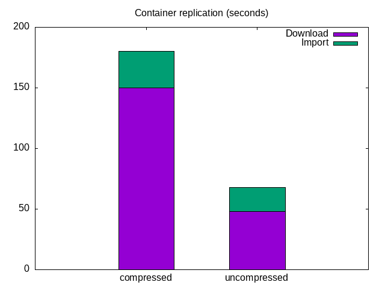

## Summary

The goal was to measure base performance of closed-container replication on high-density datanodes.

Instead of emulating errors, a stand-alone Freon (Ozone load-tester tool) test is executed to download all the available containers from the cluster (using 3 datanodes as source).

**After disabling the additional compression (gz) on the extracted container data, the replication process became 160 % faster.**



## Details

1. 3 dedicated nodes used to run an Ozone cluster with one pipeline (SCM / OM are placed to separated nodes, but shared the nodes with the datanode).
2. Everything is provisioned from Apache Ozone master (`984cf668a` + helper patches) with the help of Kubernetes resource files
3. 200 * 5Gb containers are generated with offline generator tool (OM, SCM metadata, datanode metadata + data generated) 

2. A different node hosted the replicator test which downloaded the containers from the 3 datanodes using 10 threads.
3. Everything is provisioned with Kubernetes

### First results

The first replication test took 3553 seconds (full log). Based on the log, the download part was identified as the slowest part:

For example downloading and importing one container took ~3:00 minutes.

```
2021-01-12 16:34:26 INFO  DownloadAndImportReplicator:106 - Starting replication of container 100 from [6cca312f-dde5-4ecd-a3cd-2fa73c2134da{ip: 10.42.0.22, host: 10-42-0-22.ozone-datanode-public.default.svc.cluster.local, networkLocation: /default-rack, certSerialId: null, persistedOpState: IN_SERVICE, persistedOpStateExpiryEpochSec: 0}, 0ce8b809-004c-4281-800a-ddb269d2848d{ip: 10.42.2.42, host: ozone-datanode-0.ozone-datanode.default.svc.cluster.local, networkLocation: /default-rack, certSerialId: null, persistedOpState: IN_SERVICE, persistedOpStateExpiryEpochSec: 0}, f95ddfde-175d-4abc-b889-2251188cc85c{ip: 10.42.1.42, host: 10-42-1-42.ozone-datanode-public.default.svc.cluster.local, networkLocation: /default-rack, certSerialId: null, persistedOpState: IN_SERVICE, persistedOpStateExpiryEpochSec: 0}]
2021-01-12 16:36:55 INFO  GrpcReplicationClient:186 - Container 100 is downloaded to /tmp/container-copy/container-100.tar.gz
2021-01-12 16:36:55 INFO  DownloadAndImportReplicator:119 - Container 100 is downloaded with size 4993621626, starting to import.
2021-01-12 16:37:27 INFO  DownloadAndImportReplicator:124 - Container 100 is replicated successfully
2021-01-12 16:37:27 INFO  ReplicationSupervisor:147 - Container 100 is replicated.
```

We can see ~ 2:50 minutes between the start and the end of the download, and ~0:32 required for the import of the containers.

### Local container export

After the first test, the slowness is tested with a standalone client (`ozone debug conatiner-export`) which exports containers to the local file system as tar file, using the same code path as the container replication.

```
2021-01-13 05:51:25,302 [main] INFO debug.ExportContainer: Preparation is done
2021-01-13 05:53:53,472 [main] INFO debug.ExportContainer: Container is exported to /tmp/container-3.tar.gz2021-01-13 
```

The cli here exported the container under ~2:30

When the gzip compression was turned off the export was significant faster:

```
06:11:46,254 [main] INFO debug.ExportContainer: Preparation is done
2021-01-13 06:12:11,512 [main] INFO debug.ExportContainer: Container is exported to /tmp/container-4.tar
```

Both containers were the same, generated with pseudi-random data which couldn't be compressed very well:

```
-rw-r--r--   1 root   root   4993640697 Jan 13 06:07 container-3.tar.gz
-rw-r--r--   1 root   root   4992768000 Jan 13 06:12 container-4.tar.gz
```

### Results without compression

After turning off the compression (HDDS-4687) the original test was repeated and it showed significant better (~160%) performance:

```
2021-01-14 12:44:39 INFO  BaseFreonGenerator:75 - Total execution time (sec): 1298
```

The full recovery time from ~3553 seconds reduced by ~160 %. With compression one container replication was ~2:30 (download time) + 0:30 (import time)
**Without** compression it's: ~0:48 (download) + ~0:20 (import)

## Environment

* [node2node network is 30Gbit/sec](./iperf)
* [disk speed results](./iozone)
* [Generic hardware information](./hw)