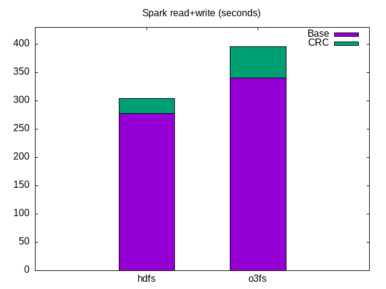

## Summary

Spark read/write performance with Ozone reported to be slow. After many improvements the tests are repeated.

Spark files are read and written from/to HDFS/Ozone to compare performance.

Ozone -- in general -- is faster when multiple clients are used: RAFT consensus algorithm has fixed cost, but the Apache Raft implementation contains a lot of optimization and batching.

Therefore only one local spark executor is used for Spar tests to check the worst case.

* Ozone is slower but performance is closer to HDFS.
* Data generation (write) performance is same as HDFS, but it can be the limitation of the data generation
* Turning off CRC generation shows significant Ozone improvement for the read/write (copy) test. HDFS CRC seems to be more effective.

All the tests are repeated with turning on and off CRC calculation. Difference of the two tests supposed to be the overhead of the CRC calculation. This overhead is less for HDFS. 




## Details

1. 3 node HDFS and Ozone cluster is used (provisioned with Kubernetes)
2. Spark run with local executor.

Commands:

```
time $SPARK_HOME/bin/spark-submit \
    --conf spark.executor.memory=4g \
    --jars /opt/ozonefs/hadoop-ozone-filesystem.jar \
    $SAMPLES_DIR/spark-samples-1.0-SNAPSHOT.jar 
```

Where the source of spark-samples can be found on [github](https://github.com/elek/spark-samples).

The relevant part of the generator is:

```java
for (int j = 0; j < iteration; j++) {
    List<Data> values = new ArrayList<>();
    for (int i = 0; i < records; i++) {
        final byte[] bytes = RandomStringUtils.randomAscii(size)
                .getBytes(StandardCharsets.UTF_8);
        values.add(new Data(j * iteration + i,
                bytes));
    }
    Dataset<Row> df = spark.createDataFrame(values, Data.class);
    df.write().mode(SaveMode.Append).parquet(testData);
}
```

Each iteration generates 100 MB of data.

Read and write is more simple:

```java
final Dataset<Row> parquet = spark
                .read()
                .parquet(source);
parquet.write().parquet(destination);
```

Full test:

```
./run_parquet.sh generate --iteration 200 o3fs://bucket1.vol1/testdata
./run_parquet.sh generate --iteration 200 hdfs://hdfs-namenode-0.hdfs-namenode:9820/testdata
./run_parquet.sh copy o3fs://bucket1.vol1/testdata o3fs://bucket1.vol1/r1
./run_parquet.sh copy hdfs://hdfs-namenode-0.hdfs-namenode:9820/testdata hdfs://hdfs-namenode-0.hdfs-namenode:9820/r1
```

Where `./run_parquet.sh` is the wrapper around the spar submit above.

## Environment

* AWS [m5ad.4xlarge](./hw) instance with default root nvme
* [dd](./dd) performance: 275 MB/s