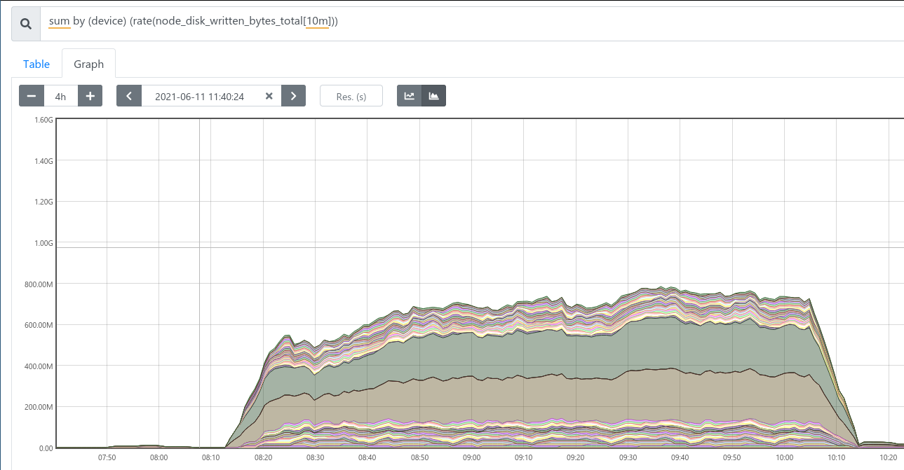
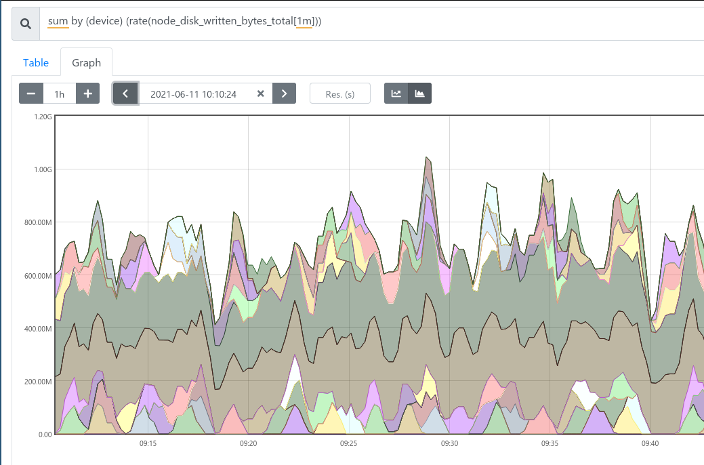
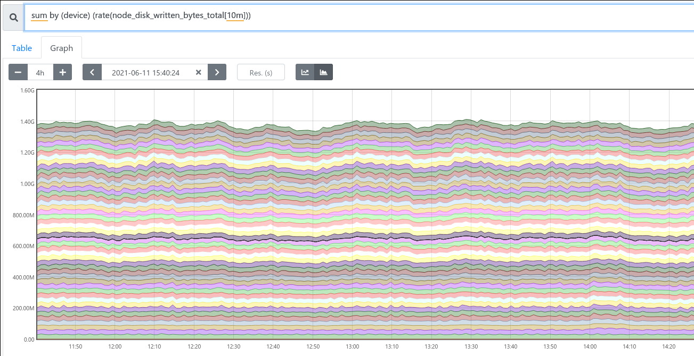

## Goal / method

The goal is checking the required time of a full replication of one, missing, high-density datanode. 

**The test**

 1. 100TB data is generated with offline data generator (`freon cgdn/cgscm/cgom`) on 3 datanodes, 1 OM and 1 SCM (all are separated hosts)
 2. Cluster is started and checked if keys are available
 3. Cluster is stopped and the full directory of one datanode is deleted
 4. Cluster is started and forced to move out from safe-mode
 5. Checked the throughput of the re-replication from monitoring (prometheus)
 
## Results

| data type | threads | data generation speed 
|---|---|---|
| Current | 10 | ~ 0.7 GB/s | 
| Proposed (netty-based) | 10 | ~ 1.35 GB/s |
| Proposed (netty-based) | 100 | ~ 1.35 GB-s 

## Observations:

Overall the netty based replication is at least 2x as fast as the existing one.

The limitation of the usage of `/tmp` is clearly visible on the per-disk level metrics:



The current solution separates import and download which makes more spikes in the throughput. See the same image as above, but with reduced average window interval:



The performance of the netty based replication was steady:



The highest performance of netty based replication was higher (3.5 GB/s) with using memdisk. We need to execute more tests to understand the difference between the measured speed and the highest possible speed.

## References

 * Used master image: [elek/ozone-dev:159fb248a](https://github.com/apache/ozone/commit/159fb248aeb5c0757519a801d4180e22ef76e911)
 * Used feature branch image: [elek/ozone-dev:7365f19ea](https://github.com/elek/ozone/commit/7365f19ea937278c3395b7cd7351ede7dd81394e)

Hardware profile (for each nodes):

```
MEMORY
	Size: 32 GB
	Size: 32 GB
	Size: 32 GB
	Size: 32 GB
	Size: 32 GB
	Size: 32 GB
	Size: 32 GB
	Size: 32 GB
	Size: 32 GB
	Size: 32 GB
	Size: 32 GB
	Size: 32 GB
CPUs
	Version: Intel(R) Xeon(R) Gold 6132 CPU @ 2.60GHz
	Max Speed: 4000 MHz
	Core Enabled: 14
	Thread Count: 28
	Version: Intel(R) Xeon(R) Gold 6132 CPU @ 2.60GHz
	Max Speed: 4000 MHz
	Core Enabled: 14
	Thread Count: 28
DISKS
     NAME      SIZE TYPE FSTYPE MOUNTPOINT   VENDOR   
     sda       7.3T disk xfs    /data/disk1  HGST      
     sdb       7.3T disk xfs    /data/disk2  HGST      
     sdc       7.3T disk xfs    /data/disk3  HGST      
     sdd       7.3T disk xfs    /data/disk4  HGST      
     sde       7.3T disk xfs    /data/disk5  HGST      
     sdf       7.3T disk xfs    /data/disk6  HGST      
     sdg       7.3T disk xfs    /data/disk7  HGST      
     sdh       7.3T disk xfs    /data/disk8  HGST      
     sdi       7.3T disk xfs    /data/disk9  HGST      
     sdj       7.3T disk xfs    /data/disk10 HGST      
     sdk       7.3T disk xfs    /data/disk11 HGST      
     sdl       7.3T disk xfs    /data/disk12 HGST      
     sdm       7.3T disk xfs    /data/disk13 HGST      
     sdn       7.3T disk xfs    /data/disk14 HGST      
     sdo       7.3T disk xfs    /data/disk15 HGST      
     sdp       7.3T disk xfs    /data/disk16 HGST      
     sdq       7.3T disk xfs    /data/disk17 HGST      
     sdr       7.3T disk xfs    /data/disk18 HGST      
     sds       7.3T disk xfs    /data/disk19 HGST      
     sdt       7.3T disk xfs    /data/disk20 HGST      
     sdu       7.3T disk xfs    /data/disk21 HGST      
     sdv       7.3T disk xfs    /data/disk22 HGST      
     sdw       7.3T disk xfs    /data/disk23 HGST      
     sdx       7.3T disk xfs    /data/disk24 HGST      
     sdy       7.3T disk xfs    /data/disk25 HGST      
     sdz       7.3T disk xfs    /data/disk26 HGST      
     sdaa      7.3T disk xfs    /data/disk27 HGST      
     sdab      7.3T disk xfs    /data/disk28 HGST      
     sdac      7.3T disk xfs    /data/disk29 HGST      
     sdad      7.3T disk xfs    /data/disk30 HGST      
     sdae      7.3T disk xfs    /data/disk31 HGST      
     sdaf      7.3T disk xfs    /data/disk32 HGST      
     sdag      7.3T disk xfs    /data/disk33 HGST      
     sdah      7.3T disk xfs    /data/disk34 HGST      
     sdai      7.3T disk xfs    /data/disk35 HGST      
     sdaj      7.3T disk xfs    /data/disk36 HGST      
     sdak      7.3T disk xfs    /data/disk37 HGST      
     sdal      7.3T disk xfs    /data/disk38 HGST      
     sdam      7.3T disk xfs    /data/disk39 HGST      
     sdan      7.3T disk xfs    /data/disk40 HGST      
     sdao      7.3T disk xfs    /data/disk41 HGST      
     sdap      7.3T disk xfs    /data/disk42 HGST      
     sdaq      7.3T disk xfs    /data/disk43 HGST      
     sdar      7.3T disk xfs    /data/disk44 HGST      
     sdas      7.3T disk xfs    /data/disk45 HGST      
     sdat      7.3T disk xfs    /data/disk46 HGST      
     sdau      7.3T disk xfs    /data/disk47 HGST      
     sdav      7.3T disk xfs    /data/disk48 HGST      
     sdaw    446.1G disk                     DRAID
     ├─sdaw1   1.9G part xfs    /boot                 
     ├─sdaw2   1.9G part swap   [SWAP]                
     └─sdaw3 442.3G part xfs    /
```
