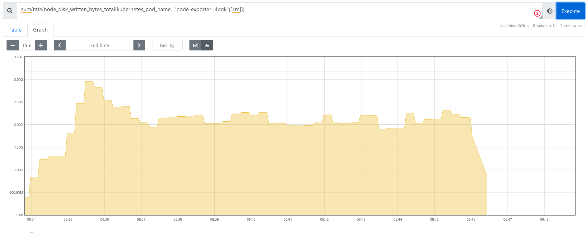
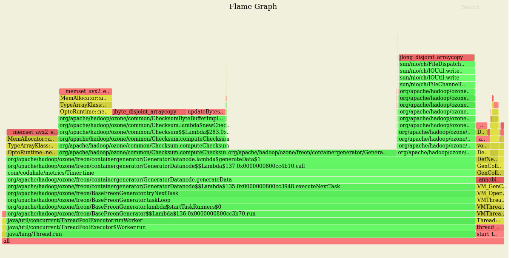

## Goal / method

Freon contains offline data generator sub-commands to generate real data without using Ratis just with writing to the disks of each node.

These tests (`freon cgom`, `freon cgscm`, `freon cgdn`) can be useful for scale testing as we don't depend on the maximum available throughput of the write path.

These offline data generators write the data directly to the RocksDB and

**The test**

 1. Ozone deployed to 5 dedicated notes (3 datanode + SCM + OM, each of them are deployed to dedicated node)
 2. Latest [Apache master](https://github.com/apache/ozone/commit/159fb248aeb5c0757519a801d4180e22ef76e911) is used, [deployed with Kubernetes](./cluster)
 3. After cluster is initialized, it was fully stopped
 4. Offline data generator started on each node parallel
 5. Each of the datanode used 47 spinning disks parallel
 6. TMP disk is real disk (not `tmpfs`)
   
## Results

| data type | threads | data generation speed 
|---|---|---|
| Random | 48 | ~ 2 GB/s | 
| Zero | 48 | ~ 2.6 GB/s |
| Random | 100 | 2.1 GB-s 



## Profile

Profiling showed that the biggest time spent on checksum generator (this can be cached for zero data generation)



Full [profile.svg](./profile.svg).

## References

Hardware profile:

```
MEMORY
	Size: 32 GB
	Size: 32 GB
	Size: 32 GB
	Size: 32 GB
	Size: 32 GB
	Size: 32 GB
	Size: 32 GB
	Size: 32 GB
	Size: 32 GB
	Size: 32 GB
	Size: 32 GB
	Size: 32 GB
CPUs
	Version: Intel(R) Xeon(R) Gold 6132 CPU @ 2.60GHz
	Max Speed: 4000 MHz
	Core Enabled: 14
	Thread Count: 28
	Version: Intel(R) Xeon(R) Gold 6132 CPU @ 2.60GHz
	Max Speed: 4000 MHz
	Core Enabled: 14
	Thread Count: 28
DISKS
     NAME      SIZE TYPE FSTYPE MOUNTPOINT   VENDOR   
     sda       7.3T disk xfs    /data/disk1  HGST      
     sdb       7.3T disk xfs    /data/disk2  HGST      
     sdc       7.3T disk xfs    /data/disk3  HGST      
     sdd       7.3T disk xfs    /data/disk4  HGST      
     sde       7.3T disk xfs    /data/disk5  HGST      
     sdf       7.3T disk xfs    /data/disk6  HGST      
     sdg       7.3T disk xfs    /data/disk7  HGST      
     sdh       7.3T disk xfs    /data/disk8  HGST      
     sdi       7.3T disk xfs    /data/disk9  HGST      
     sdj       7.3T disk xfs    /data/disk10 HGST      
     sdk       7.3T disk xfs    /data/disk11 HGST      
     sdl       7.3T disk xfs    /data/disk12 HGST      
     sdm       7.3T disk xfs    /data/disk13 HGST      
     sdn       7.3T disk xfs    /data/disk14 HGST      
     sdo       7.3T disk xfs    /data/disk15 HGST      
     sdp       7.3T disk xfs    /data/disk16 HGST      
     sdq       7.3T disk xfs    /data/disk17 HGST      
     sdr       7.3T disk xfs    /data/disk18 HGST      
     sds       7.3T disk xfs    /data/disk19 HGST      
     sdt       7.3T disk xfs    /data/disk20 HGST      
     sdu       7.3T disk xfs    /data/disk21 HGST      
     sdv       7.3T disk xfs    /data/disk22 HGST      
     sdw       7.3T disk xfs    /data/disk23 HGST      
     sdx       7.3T disk xfs    /data/disk24 HGST      
     sdy       7.3T disk xfs    /data/disk25 HGST      
     sdz       7.3T disk xfs    /data/disk26 HGST      
     sdaa      7.3T disk xfs    /data/disk27 HGST      
     sdab      7.3T disk xfs    /data/disk28 HGST      
     sdac      7.3T disk xfs    /data/disk29 HGST      
     sdad      7.3T disk xfs    /data/disk30 HGST      
     sdae      7.3T disk xfs    /data/disk31 HGST      
     sdaf      7.3T disk xfs    /data/disk32 HGST      
     sdag      7.3T disk xfs    /data/disk33 HGST      
     sdah      7.3T disk xfs    /data/disk34 HGST      
     sdai      7.3T disk xfs    /data/disk35 HGST      
     sdaj      7.3T disk xfs    /data/disk36 HGST      
     sdak      7.3T disk xfs    /data/disk37 HGST      
     sdal      7.3T disk xfs    /data/disk38 HGST      
     sdam      7.3T disk xfs    /data/disk39 HGST      
     sdan      7.3T disk xfs    /data/disk40 HGST      
     sdao      7.3T disk xfs    /data/disk41 HGST      
     sdap      7.3T disk xfs    /data/disk42 HGST      
     sdaq      7.3T disk xfs    /data/disk43 HGST      
     sdar      7.3T disk xfs    /data/disk44 HGST      
     sdas      7.3T disk xfs    /data/disk45 HGST      
     sdat      7.3T disk xfs    /data/disk46 HGST      
     sdau      7.3T disk xfs    /data/disk47 HGST      
     sdav      7.3T disk xfs    /data/disk48 HGST      
     sdaw    446.1G disk                     DRAID
     ├─sdaw1   1.9G part xfs    /boot                 
     ├─sdaw2   1.9G part swap   [SWAP]                
     └─sdaw3 442.3G part xfs    /
```
